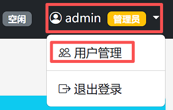
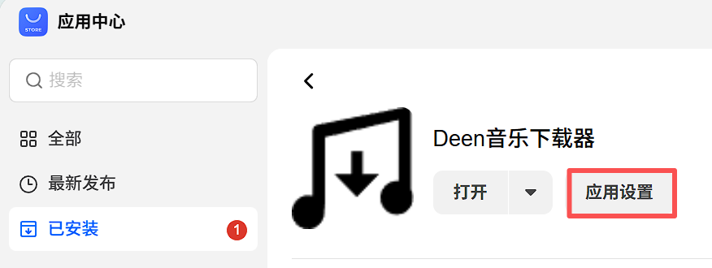
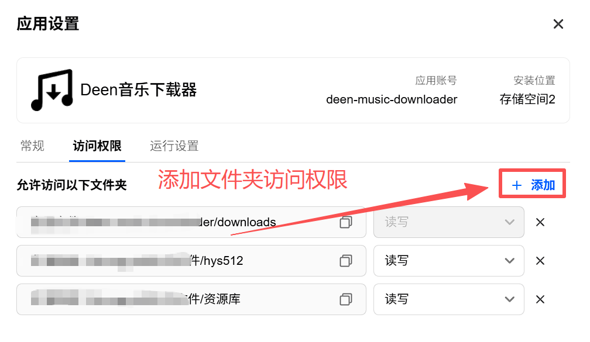
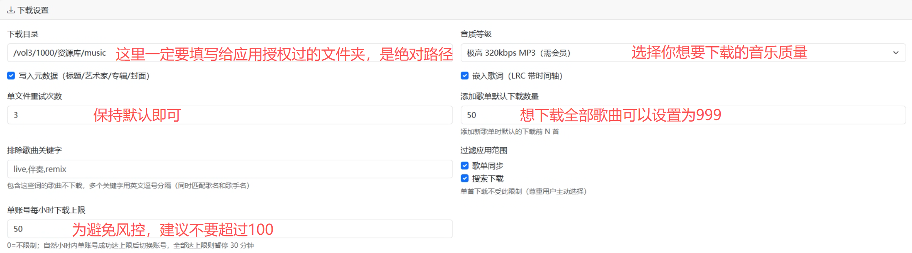
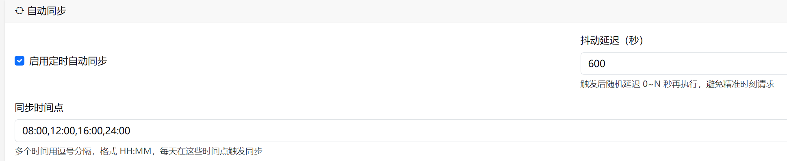
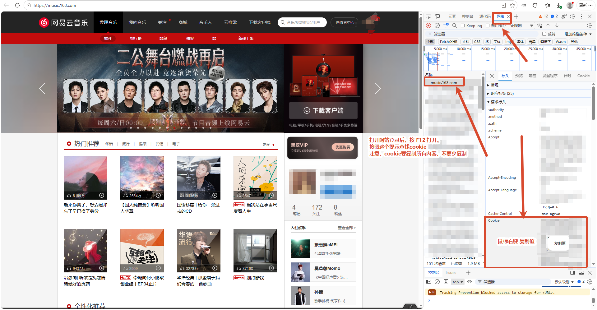
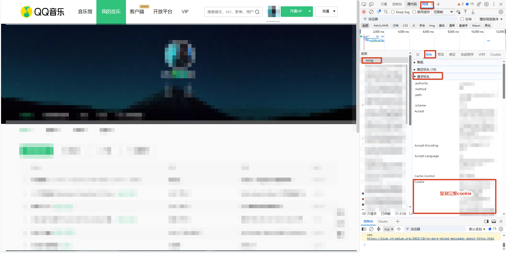

# Deen音乐下载器-初次使用教程

## 一、登录并且修改默认密码

默认用户名：admin

默 认 密 码：admin123

登录后在界面右上角修改密码

## 二、设置下载文件夹

### 1.飞牛给需要下载的文件夹授权

### 2、服务设置

1. web服务 和 api设置 保持默认即可（已内置api服务，无需用户外部搭建）

2. 下载设置说明如下：
    

3. 同步歌单设置：
      

4. 登陆账号，目前支持qq、网易云、酷狗音乐。在账号管理页面右上角点击‘添加账号’
   

5. 添加歌单（歌单添加后会根据你设置的歌单同步时间同步）：
   
   - 网易云音乐，= 后边`2179431622`是歌单id。
     https://music.163.com/#/playlist?id=2179431622
   - QQ音乐，最后的数字`7074538435`是歌单ID
     https://y.qq.com/n/ryqq_v2/playlist/7074538435

### 各平台cookie的获取

- 网易云打开网址：https://music.163.com/

- QQ音乐打开网址：https://y.qq.com/n/ryqq_v2/profile/like/song

- 酷狗音乐直接扫码获取cookie即可

